[TOC]

# *Ashen Requiem* State Machine Ver. Developing Log

## 创建状态机

创建PlayerState.cs，PlayerStateMachine.cs,Player.cs

### PlayerState.cs

```
using UnityEngine;

public class PlayerState
{
    protected PlayerStateMachine stateMachine;
    protected Player player;

    private string animBoolName;
    public PlayerState(Player _player, PlayerStateMachine _stateMachine, string _animBoolName)
    {
        this.player = _player;
        this.stateMachine = _stateMachine;
        this.animBoolName = _animBoolName;
    }

    public virtual void Enter()
    {

    }
    public virtual void Update()
    {

    }
    public virtual void Exit()
    {

    }
}

```

### PlayerStateMachine.cs

```
using UnityEngine;

public class PlayerStateMachine
{
    public PlayerState currentState {  get; private set; }
   
    public void Initialize(PlayerState _startState)
    {
        currentState = _startState;
        currentState.Enter();
    }
    public void ChangeState(PlayerState _newState)
    {
        currentState.Exit();
        currentState= _newState;
        currentState.Enter();
    }
}

```

继续创建两个脚本PlayerIdleState.cs，PlayerMoveState.cs

全部继承改为PlayerState后，快速构造函数+快速重写Enter(),Exit(),Update()

### Player.cs

```
using UnityEngine;

public class Player : MonoBehaviour
{
    public PlayerStateMachine stateMchine { get; private set; }

    public PlayerIdleState idleState { get; private set; }
    public PlayerMoveState moveState { get; private set; }

    private void Awake()
    {
        stateMchine = new PlayerStateMachine();

        idleState = new PlayerIdleState(this, stateMchine, "Idle");
        moveState = new PlayerMoveState(this, stateMchine, "Move");
    }

    private void Start()
    {
        stateMchine.Initialize(idleState);
    }

    private void Update()
    {
        stateMchine.currentState.Update();
    }
}

```


### PlayerIdleState.cs

### PlayerMoveState.cs

## 动画

Player.cs中

```
public Animator anim {  get; private set; }
```

start()

```
anim = GetComponentInChildren<Animator>();
```

PlayerState.cs中，设置进出状态

```
public virtual void Enter()
{
    player.anim.SetBool(animBoolName, true);
}
public virtual void Update()
{

}
public virtual void Exit()
{
    player.anim.SetBool(animBoolName, false);
}
```

## 可读性增强

```
#region Components
public Animator anim {  get; private set; }
#endregion
```

使得可折叠

## 动作

新建平台，添加碰撞箱（角色+平台） ，为角色添加刚体，定Z轴以及相关设置

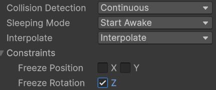

重要：添加刚体后再Player.cs中新建

```
rb = GetComponent<Rigidbody2D>();
```


### 移动

PlayerState.cs中，新建

```
protected float xInput;
public virtual void Update()
{
    xInput = Input.GetAxisRaw("Horizontal");
}
```

PlayerIdleState.cs中

```
public override void Update()
{
    base.Update();
    if (xInput != 0)
        stateMachine.ChangeState(player.moveState);
}
```

相应，PlayerMoveState.cs中

```
public override void Update()
{
    base.Update();
    if (xInput == 0)
        stateMachine.ChangeState(player.idleState);
}
```

添加速度，转至Player.cs

```
public Rigidbody2D rb { get; private set; }
```

设置新函数

```
public void SetVelocity(float _xVelocity,float _yVelocity)
{
    rb.linearVelocity=new Vector2(_xVelocity, _yVelocity);
}
```

设置移动速度参数

```
[Header("Move info")]
public float moveSpeed;
```

### 跳跃

新建混合树，添加动作后去掉Automate Thresholds

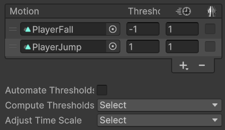

新建C#后在Player.cs声明

```
public PlayerJumpState jumpState { get; private set; }
public PlayerAirState airState { get; private set; }
```

设置跳跃力参数，以便跳跃速度设置

```
[Header("Move info")]
public float moveSpeed;
public float jumpForce;
```

Awake()

```
jumpState = new PlayerJumpState(this, stateMchine, "Jump");
airState = new PlayerAirState(this, stateMchine, "Jump");
```

#### PlayerJumpState.cs

```
 public override void Enter()
 {
     base.Enter();

     player.rb.linearVelocity = new Vector2(player.rb.linearVelocity.x, player.jumpForce);
 }
 public override void Update()
{
    base.Update();

    if (player.rb.linearVelocity.y < 0)
        stateMachine.ChangeState(player.airState);
}
```


#### PlayerAirState.cs

```
public override void Update()
{
    base.Update();
    if (player.rb.linearVelocity.y == 0)
        stateMachine.ChangeState(player.idleState);
}
```

### 翻转人物

新建变量并初始化

```
public int facingDir { get; private set; } = 1;
private bool facingRight = true;
```

新建函数

```
public void Flip()
{
    facingDir *= -1;
    facingRight = !facingRight;
    transform.Rotate(0, 180, 0);
}

public void FlipController()
{
    if (rb.linearVelocity.x > 0 && !facingRight)
        Flip();
    else if (rb.linearVelocity.x < 0 && facingRight)
        Flip();

}
```

在Update()调用Flipcontroller()

检测发现上述代码无法实现类似被击退功能

修改FlipController() SetVelocity()，使得只有主动输入方向才能实现翻转

```
public void FlipController(float _x)
{
    if (_x > 0 && !facingRight)
        Flip();
    else if (_x < 0 && facingRight)
        Flip();

}
public void SetVelocity(float _xVelocity, float _yVelocity)
{
    rb.linearVelocity = new Vector2(_xVelocity, _yVelocity);
    FlipController(_xVelocity);
}
```

### :wheelchair:冲刺！冲刺！:wheelchair:

新建

#### PlayerDashState.cs

Player.cs中，新建

```
public PlayerDashState dashState { get; private set; }
```

和Awake()

```
dashState = new PlayerDashState(this, stateMchine, "Dash");
```

相当于声明变量后利用本身构造函数初始化

在PlayerState新建计时器

PlayerDashState.cs中，设置stateTimer = player.dashDuration;和退出状态

出现滑墙情况：Exit状态设置横向速度为0

#### 冲刺冷却

```
[Header("Dash info")]
[SerializeField] private float dashCooldown;
private float dashUsageTimer;
```

```
private void CheckForDashInput()
{
    dashUsageTimer-= Time.deltaTime; ;

    if (Input.GetKeyDown(KeyCode.LeftShift) && dashUsageTimer < 0) 
    {
        dashDir = Input.GetAxisRaw("Horizontal");
        dashUsageTimer = dashCooldown;
        if (dashDir == 0)
            dashDir = facingDir;
        stateMachine.ChangeState(dashState);
    }
}
```

### 滑墙

新建材料：摩擦力设为0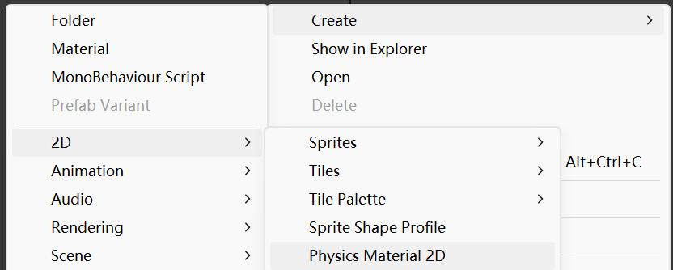

#### PlayerWallSlideState.cs

代码：

```
if (xInput == player.facingDir)
{
    player.SetVelocity(0, 0);
}
```

你的本意是「停止一切移动」，但角色还是**慢慢往下掉**，原因如下👇

------

🎯 真正的原因：**你只清零了“瞬时速度”，但没有禁止重力作用**

在 Unity 中，只要 Rigidbody2D 的 `gravityScale` 不为 0，**每帧都会自动给它往下加速度（重力）**，哪怕你刚刚把速度设成了 0，它下帧又会继续掉下去。

改正：没写，感觉不用停:yum:

### 蹬墙跳

#### PlayerWallJump.cs

##### 重要bug：Update及时return

若在WallSlide设置进入状态条件，会导致以下不必要的动作在同一帧发生，因此需要return

```
if (Input.GetKeyDown(KeyCode.Space))
{
    stateMachine.ChangeState(player.wallJumpState);
    return;
}
```

##### 蹬墙跳计时器

设置了一个0.1f的计时器，之后才能进入airState，是因为airState包含输入的空中移动，需要有一段时间使得蹬墙跳强制远离墙面防止连续贴墙bug

### 攻击动画

#### PlayerPrimaryAttackState.cs

需要设置退出时间以确保完整攻击动作

设置trigger来结束(类似计时器)

```
protected float stateTimer;
protected bool triggerCalled;
```

初始化为false，同样在PlayerState.cs

```
public virtual void AnimationFinishTrigger()
{
    triggerCalled = true;
}
```

后在PlayerPrimaryAttackState.cs

```
public override void Update()
{
    base.Update();

    if (triggerCalled)
        stateMachine.ChangeState(player.idleState);
}
```

Player.cs

```
public void AnimationTrigger() => stateMachine.currentState.AnimationFinishTrigger();
```

新建脚本

#### PlayerAnimationTriggers.cs

```
public class PlayerAnimationTriggers : MonoBehaviour
{
    private Player player => GetComponentInParent<Player>();
    private void AnimationTrigger()
    {
        player.AnimationTrigger();
    }
}
```

将其拖入Animator之后在动画结束帧事件调用

#### 滑步问题

未知原因，用update设0解决

更新，优解

攻击脚本设置一个.1f计时器

update中

```
if (stateTimer < 0)
    player.rb.linearVelocity = new Vector2(0, 0);
```

不妨碍之后为攻击设置初速度

#### Combo Attack

创建子状态机并设置ComboCounter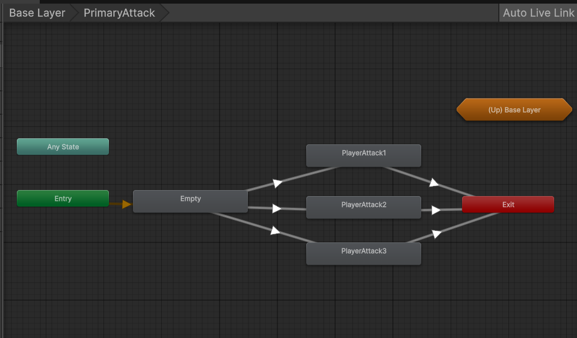

之后在PlayerPrimaryAttackState.cs中设置连击窗口时间

##### 略微提升打击感策略

player新建

```
[Header("Attack details")]
public Vector2[] attackMovement;
```

```
player.SetVelocity(player.attackMovement[comboCounter].x * player.facingDir, player.attackMovement[comboCounter].y);
```

根据所设数值可实现跳劈

##### 加攻速方法

```
player.anim.speed
```

### 攻击判定

```
public Transform attackCheck;
public float attackCheckRadius;
```

DrawGizmos

```
Gizmos.DrawWireSphere(attackCheck.position, attackCheckRadius);
```

Entity中，新建Damage函数

```
public virtual void Damage()
{
    Debug.Log(gameObject.name + "was damaged");
}
```

由于要在动画帧加入事件来判定攻击，故AnimationTriggers()

```
private void AttackTrigger()
{
    Collider2D[] colliders = Physics2D.OverlapCircleAll(player.attackCheck.position, player.attackCheckRadius);

//是一个 foreach 循环，用于遍历你通过 Physics2D.OverlapCircleAll 获取到的所有 Collider2D 对象。
//colliders：是一个 Collider2D[] 数组，包含了圆形检测范围内所有命中的碰撞体。
//var hit：在每次循环中，hit 代表数组中的一个 Collider2D。
//var 自动推断类型，在这里相当于：Collider2D hit
    foreach(var hit in colliders)
    {
        if (hit.GetComponent<Enemy>() != null)
            hit.GetComponent<Enemy>().Damage();
    }
}
```

然后对enemy复刻上操作

#### 避免重复命中

```
命中标记：用哈希集（HashSet<Enemy>）记录已命中的敌人，避免同一敌人重复受击：
csharp
private HashSet<Enemy> hitEnemies = new HashSet<Enemy>();

foreach (Collider2D hit in colliders)
{
    Enemy enemy = hit.GetComponent<Enemy>();
    if (enemy != null && !hitEnemies.Contains(enemy))
    {
        hitEnemies.Add(enemy);
        // 处理伤害...
    }
}
```


### 受击特效

创建新材料，gui设为白色

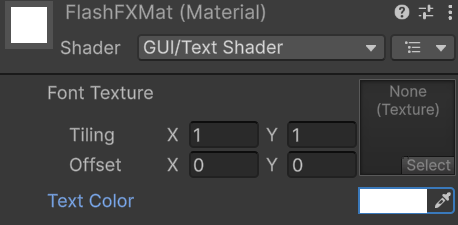

新建脚本

#### EntityFX.cs

```
private SpriteRenderer sr;

[Header("Flash FX")]
[SerializeField] private Material hitMat;
private Material originalMat;

private void Start()
{
    sr = GetComponentInChildren<SpriteRenderer>();
    originalMat = sr.material;
}

private IEnumerator FlashFX()
{
    sr.material = hitMat;
    yield return new WaitForSeconds(.2f);
    sr.material = originalMat;
}
```

随后在Entity声明

public EntityFX fx { get; private set; }

fx = GetComponentInChildren<EntityFX>();

```
public virtual void Damage()
{
    fx.StartCoroutine("FlashFX");
}
```

将脚本拖入Player和Enemy。选择受击材料

### 击退效果

```
[Header("Knockback info")]
[SerializeField] protected Vector2 knockbackDir;
[SerializeField] protected float knockbackDuration;
protected bool isKnocked;
```

```
protected virtual IEnumerator HitKnockback()
{
	//isKnock为true时无法设置速度
    isKnocked = true;
    rb.linearVelocity = new Vector2(knockbackDir.x * -facingDir, knockbackDir.y);
    yield return new WaitForSeconds(knockbackDuration);
    isKnocked = false;
}
```

```
//在Damage()中Start
StartCoroutine("HitKnockback");
```

受击反向

```
//eg. playeranimationtriggers
foreach (var hit in colliders)
{
    if (hit.GetComponent<Enemy>() != null)
    {
        EnemyStats _target=hit.GetComponent<EnemyStats>();

        player.stats.DoDamage(_target);

        if (player.transform.position.x < hit.GetComponent<Enemy>().transform.position.x && hit.GetComponent<Enemy>().facingRight)
            hit.GetComponent<Enemy>().Flip();
        else if(player.transform.position.x > hit.GetComponent<Enemy>().transform.position.x && !hit.GetComponent<Enemy>().facingRight)
            hit.GetComponent<Enemy>().Flip();

        hit.GetComponent<Enemy>().Damage();
    }
}
```


#### 闪烁效果

在EntityFX声明

```
private void RedColorBlink()
{
    if (sr.color != Color.white)
    {
        sr.color = Color.white;
    }
    else
        sr.color = Color.red;
}
```

后在需要的状态Entry()

```
enemy.fx.InvokeRepeating("RedColorBlink", 0, .1f);
```

目前为止无法退出闪烁，因此

```
private void CancelRedBlink()
{
    CancelInvoke();
    sr.color = Color.white;
}
```

后在需要的状态Exit()

```
enemy.fx.Invoke("CancelRedBlink", 0);
```

### 眩晕效果+危

完善

```
[Header("Stunned info")]
public float stunDuration;
public Vector2 stunDir;
protected bool canbeStunned;//原理：在敌人进行攻击动作时露出破绽 因此需要动画事件帧
[SerializeField] protected GameObject counterImage;
```

Enemy类中声明

```
public virtual void OpenCounterAttackWindow()
{
    canbeStunned = true;
    counterImage.SetActive(true);
}

public virtual void CloseCounterAttackWindow()
{
    canbeStunned = false;
    counterImage.SetActive(false);
}
```

随后在对应的AnimationTrigger脚本中实现

```
    public void OpenCounterWindow() => skeleton.OpenCounterAttackWindow();
    public void CloseCounterWindow() => skeleton.CloseCounterAttackWindow();
```

Enemy类

```
protected virtual bool CanBeStunned()
{
    if (canbeStunned)
    {
        CloseCounterAttackWindow();
        return true;
    }
    return false;
}
```

具体怪物override

```
protected override bool CanBeStunned()
{
    if(base.CanBeStunned())
    {
        stateMachine.ChangeState(stunnedState);
        return true;
    }
    return false;
}
```

### 居合斩

新建两个动画：居合姿态和斩姿态

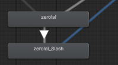

首次出现：状态切换起始位置非Entry，且斩的退出条件为居合false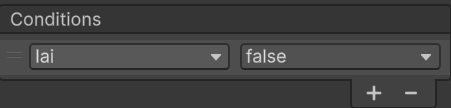

用动画trigger退出

```
public override void Enter()
{
    base.Enter();

    stateTimer = player.iaiDuration;
    player.anim.SetBool("Iai_Slash", false);
    //enter阶段设置斩为假
}
```

```
public override void Update()
{
    base.Update();
//套用AttackTrigger检测函数，稍作修改
    Collider2D[] colliders = Physics2D.OverlapCircleAll(player.attackCheck.position, player.attackCheckRadius);


    foreach (var hit in colliders)
    {
        if (hit.GetComponent<Enemy>() != null)
        {
            if (hit.GetComponent<Enemy>().CanBeStunned())
            {
                stateTimer = 10;
                player.anim.SetBool("Iai_Slash", true);

            }
        }
    }

    if (stateTimer < 0 || triggerCalled)
        stateMachine.ChangeState(player.idleState);
}
```

修改，类似特殊纳刀，按键进入准备姿态，准备姿态按键生成判定框

另添加计帧判定

```
using UnityEngine;

public class PlayerIaiState : PlayerState
{
    public PlayerIaiState(Player _player, PlayerStateMachine _stateMachine, string _animBoolName) : base(_player, _stateMachine, _animBoolName)
    {
    }


    private int attackWindowFrames;
    private const int maxAttackWindowFrames = 10;
    public override void Enter()
    {
        base.Enter();

        stateTimer = player.iaiDuration;

        player.anim.SetBool("Iai_Slash", false);
        attackWindowFrames = 0;

    }

    public override void Exit()
    {
        base.Exit();
    }

    public override void Update()
    {
        base.Update();
        player.ZeroVelocity();

        if (Input.GetKeyDown(KeyCode.Mouse0) && attackWindowFrames == 0)
        {
            attackWindowFrames = maxAttackWindowFrames;
        }
		
		//改成1修复连按可以一直触发居合窗口的bug
        if (attackWindowFrames > 0)
        {
            attackWindowFrames--;
            
            Collider2D[] colliders = Physics2D.OverlapCircleAll(player.attackCheck.position, player.attackCheckRadius);


            foreach (var hit in colliders)
            {
                if (hit.GetComponent<Enemy>() != null)
                {
                    if (hit.GetComponent<Enemy>().CanBeStunned())
                    {
                        stateTimer = 10;
                        player.anim.SetBool("Iai_Slash", true);

                        if (player.transform.position.x < hit.GetComponent<Enemy>().transform.position.x && hit.GetComponent<Enemy>().facingRight)
                            hit.GetComponent<Enemy>().Flip();
                        else if (player.transform.position.x > hit.GetComponent<Enemy>().transform.position.x && !hit.GetComponent<Enemy>().facingRight)
                            hit.GetComponent<Enemy>().Flip();

                        hit.GetComponent<Enemy>().Damage();

                        AttackScene.Instance.HitPause(player.iaiSlashHitPause);
                        AttackScene.Instance.CameraShake(player.iaiSlashShakeTime, player.iaiSlashHitMagnitude);

                        EnemyStats _target = hit.GetComponent<EnemyStats>();

                        player.stats.DoDamage(_target);
                        player.stats.DoMagicalDamage(_target);

                        attackWindowFrames = -1;
                        break;
                    }
                }
            }
        }


        if (stateTimer < 0 || triggerCalled )
            stateMachine.ChangeState(player.idleState);
        if (Input.GetKeyDown(KeyCode.LeftShift) && SkillManager.Instance.dash.CanUseSkill())
        {
            player.dashDir = Input.GetAxisRaw("Horizontal");
            if (player.dashDir == 0)
                player.dashDir = player.facingDir;
            player.stateMachine.ChangeState(player.dashState);
        }
    }
}

```

添加起始阶段向后位移

```
private float backwardTimer;
private Vector2 startPosition;
private const float backwardDuration = 0.2f;
private const float backwardDistance = 0.8f;
public override void Enter()
{
    base.Enter();

    startPosition = player.transform.position;
    backwardTimer = 0f;

    stateTimer = player.iaiDuration;

    player.anim.SetBool("Iai_Slash", false);
    attackWindowFrames = 0;

}

//update下
if (backwardTimer < backwardDuration)
{
    backwardTimer += Time.deltaTime;
    
   	//backwardTimer / backwardDuration 将计时器值转换为 0~1 的进度百分比。
	//Mathf.Min(1f, ...) 确保进度不会超过 1（防止溢出）。
    float progress = Mathf.Min(1f, backwardTimer / backwardDuration);

	
    float easeProgress = 1 - Mathf.Pow(1 - progress, 2);

    Vector2 backwardDir = -player.facingDir * Vector2.right;

    player.transform.position = (Vector3)startPosition + (Vector3)(backwardDir * backwardDistance * easeProgress);
}
```


### 打击感具体实现

> **DOTween (HOTween v2)     extra**

在完成攻击具体判定之后，试为场景添加具体的打击感，如屏幕抖动、受击停顿等等类似效果

新建脚本AttackScene.cs

该类作为工具类添加到主相机，仍然采用单例模式，确保在场景中全局只有一个实例，方便在其它类调用

```
private static AttackScene instance;
public static AttackScene Instance
{
    get
    {
        if (instance == null)
            instance = Object.FindFirstObjectByType<AttackScene>();
        return instance;
    }
}
```

`Object.FindFirstObjectByType<AttackScene>()`

- 这是 Unity 新版本引入的 API（从 Unity 2023 开始支持）。
- 它的功能是**返回场景中第一个匹配指定类型 `T` 的对象**，和旧版差不多，但内部实现更加高效。
- 性能提升主要是优化了搜索算法，减少遍历，速度更快。
- 这个方法避免了老方法在大型项目里可能引起的性能瓶颈。
- 它也是静态方法，调用方式与旧版类似。

#### 时停协程

```
public void HitPause(int duration)
{
    StartCoroutine(Pause(duration));
}

IEnumerator Pause(int duration)
{
    float pauseTime = duration / 60f;
    Time.timeScale = 0;
    yield return new WaitForSecondsRealtime(pauseTime);
    //WaitForSecondsRealtime等待真实时间（不受timeScale影响）
    Time.timeScale = 1;
}
```

#### 时缩协程

```
public void UseTimeShrink(int duration)
{
    StartCoroutine(TimeShrink(duration));
}

IEnumerator TimeShrink(int duration)
{
    float pauseTime = duration / 60f;
    Time.timeScale = 0.1f;
    yield return new WaitForSecondsRealtime(pauseTime);
    Time.timeScale = 1;
}
```

#### 相机震动协程

```
public void CameraShake(float duration, float magnitude)
{
    if(!isShake)
        StartCoroutine(Shake(duration, magnitude));
}

IEnumerator Shake(float duration, float magnitude)
{
    isShake = true;
    Transform camera = Camera.main.transform;
    Vector3 startPosition = camera.position;

    while (duration > 0) 
    {
        camera.position = Random.insideUnitSphere * magnitude + startPosition;
        duration -= Time.deltaTime;

        yield return null;
    }
    camera.position = startPosition;
    isShake= false;

}
```

完善[Header("Attack details")]

```
[Header("Attack details")]
public Vector2[] attackMovement;
public float iaiDuration;
public GameObject slashEffectPrefab;
public float shakeTime;
public int hitPause;
public float hitMagnitude;
```

在AttackTrigger()以及对应动作hit上调用协程

```
AttackScene.Instance.HitPause(player.hitPause);
AttackScene.Instance.CameraShake(player.shakeTime, player.hitMagnitude);
```

出现问题：与CinemaMachine冲突

```
Transform cinemaMachine = camera.transform.parent.Find("CinemachineCamera");
var vm = cinemaMachine.GetComponent<CinemachineCamera>();
float shackBuffer = .1f;
vm.enabled = false;
```

##### 喜报：历时两个小时找到最佳解决方案

之前的版本由于主相机和cinemachine位置同一，为实现震动必须将cinemachine先关闭再打开，在协程结束后会有抽帧的感觉

最终发现改变cinemachine的Follow即可解决，计时前vm.Follow = null;，发生完毕再vm.Follow = PlayerManager.instance.player.transform;无敌的敌

```
IEnumerator Shake(float duration, float magnitude)
{
    isShake = true;
    Transform camera = Camera.main.transform;

    Transform cinemaMachine = camera.transform.parent.Find("CinemachineCamera");
    var vm = cinemaMachine.GetComponent<CinemachineCamera>();
    Vector3 startPosition = camera.position;
    //vm.enabled = false;
    vm.Follow = null;
    while (duration > 0)
    {
        cinemaMachine.position = Random.insideUnitSphere * magnitude + startPosition;
        duration -= Time.deltaTime;

        yield return null;
    }
    camera.position = startPosition;
    isShake = false;
    
    //vm.enabled = true;
    vm.Follow = PlayerManager.instance.player.transform;
}
```

再添加受击特效，动画器新建Trigger

```
//Enemy中
private Animator hitFXAnimator;

//start()
hitFXAnimator=transform.Find("HitFX").GetComponentInChildren<Animator>();

//enemy重写Damage
public override void Damage()
{
    base.Damage();
    hitFXAnimator.SetTrigger("Hit");
}
```

注意默认空状态


至此，艺术已成

### 黄金树立誓

新增动画zeroOath，之后可用于技能或升级，调试阶段按O实现

封装为技能

#### 镜头动画实现


### RiderKick

新增动画zeroKick

加入受击判定框

绷

增加Enemy处于Counter状态的派生，目前用的方法是

```
if (hit.GetComponent<Enemy>().canbeStunned)
{
    player.stateMachine.ChangeState(player.dragonState);
}

//Player下新增无敌状态变量
[Header("MODE")]
public bool GOD = false;

//修改Enemy攻击判定条件
if (hit.GetComponent<Player>() != null && hit.GetComponent<Player>().GOD == false)
```

进出Dragon状态进行状态修改


测试发现有时进入GOD模式会有时间差，有时总是先受击再进入GOD模式

新思路：新加动画帧时间，为kick动作加上无敌帧

调试找出原地冲刺原因

```
private void CheckForDashInput()
{

    if (Input.GetKeyDown(KeyCode.LeftShift) && SkillManager.Instance.dash.CanUseSkill()) 
    {
        dashDir = Input.GetAxisRaw("Horizontal");
        if (dashDir == 0)
            dashDir = facingDir;
        stateMachine.ChangeState(dashState);
    }
}

private void DragonApproaching()
{
    if(Input.GetKeyDown(KeyCode.RightShift)&&SkillManager.Instance.dragon.CanUseSkill())
    {
        dashDir = Input.GetAxisRaw("Horizontal");
        if (dashDir == 0)
            dashDir = facingDir;
        stateMachine.ChangeState(dragonState);
    }
}
```

初始没有像直接用方法一样定义冲刺方向，需要更改KickTrigger

## 技能树

### 单例模式

新建PlayerManager.cs

这段代码的作用是实现 **单例模式（Singleton Pattern）**，也就是确保在场景中全局只有一个 `PlayerManager` 实例，并且可以通过 `PlayerManager.instance` 在其他脚本中轻松访问它。

```
public static PlayerManager instance;
//声明一个 静态变量 instance，可以通过 PlayerManager.instance 在项目的任何地方访问。
//static 意味着它不依赖于具体某个实例，而是属于类本身。
public Player player;

 private void Awake()
{
    if (instance != null)
        Destroy(instance.gameObject);
    else
        instance = this;
}
//在 Unity 中，Awake() 是生命周期中最早被调用的方法之一。this 代表当前这个 PlayerManager 脚本附着的对象的实例。
//所以这句话表示：当这个对象被激活时，把它自己存到静态变量 instance 中，供全局访问。
```

用这种方式，在类似BattleState中，就可以

```
//player = GameObject.Find("Zero").transform;
player = PlayerManager.instance.player.transform;
```

随后在Hierarchy创建empty并拖入

同样方法创建SkillManager

### 技能基础+技能CD

#### Skill.cs

```
public class Skill : MonoBehaviour
{
    [SerializeField] protected float cooldown;
    protected float cooldownTimer;

    protected virtual void Update()
    {
        cooldownTimer -= Time.deltaTime;
    }

    public virtual bool CanUseSkill()
    {
        if (cooldownTimer <= 0)
        {
            cooldownTimer = cooldown;
            return true;
        }
        Debug.Log("Skill is on CD.");
        return false;
    }

    public virtual void UseSkill()
    {

    }
}
```

重写一个简单的Dash_Skill脚本

```
public override void UseSkill()
{
    base.UseSkill();
}
```

写完在manager声明并拖入

```
public Dash_Skill dash {  get; private set; }

private void Start()
{
    dash = GetComponent<Dash_Skill>();
}
```

在Player引用，修改之前冷却条件

```
if (Input.GetKeyDown(KeyCode.LeftShift) && SkillManager.Instance.dash.CanUseSkill()) 
```

进行子类技能复写

```
private Player player;

private void Start()
{
    player = PlayerManager.instance.player;
}
public override void UseSkill()
{
    base.UseSkill();
}

public override bool CanUseSkill()
{
    if (player.IsGroundDetected())
    {
        if (cooldownTimer <= 0)
        {
            cooldownTimer = cooldown;
            return true;
        }
        Debug.Log("冲多了导致的");
        return false;
    }
    return false;
}
```

### 影分身能力

将首帧动画拖入文件，新建AC，修改图层，将已有的Idle等动作拖入Animator

#### Prefab

`Prefab` 是 Unity 中非常重要的一个概念，简单来说，它是一个 **预制体（可重复使用的游戏对象模板）**。下面是一个详细解释，帮你理解和使用它：

------

##### 🧱 什么是 Prefab？

Prefab 是一个保存了 GameObject 及其所有组件和子对象的 **模板对象**。它可以反复在场景中实例化（创建）而无需重新设置。

------

##### ✅ Prefab 的常见用途：

1. **重复使用**：如敌人、道具、子弹、特效等可以多次生成。
2. **批量修改**：改一次 Prefab，所有实例都会同步更新。
3. **动态生成**：使用脚本 `Instantiate()` 创建实例。

新建Prefabs文件夹，将Shadow拖入，可在Hierarchy删除

新建技能脚本，进行技能的基本操作

Shadow_Skill.cs

```
[SerializeField] private GameObject shadowPrefab;

public void CreateShadow()
{
    GameObject newShadow = Instantiate(shadowPrefab);
}
```

在冲刺时生成残影

```
SkillManager.Instance.shadow.CreateShadow();//dashState的Enter
```

添加效果，在预制体添加Script:Shadow_Skill_Controller.cs

```
public void SetupShadow(Transform _newTransform)
{
    transform.position = _newTransform.position;
}
```

制作淡出效果

```
private SpriteRenderer sr;
[SerializeField] private float colorLosingSpeed;

[SerializeField] private float shadowDuration;
private float shadowTimer;

private void Awake()
{
    sr = GetComponent<SpriteRenderer>();
}
public void Update()
{
    shadowTimer -= Time.deltaTime;

    if (shadowTimer <= 0)
    {
        sr.color = new Color(1f, 1f, 1f, sr.color.a - (Time.deltaTime * colorLosingSpeed));
    }
    //自动销毁功能
    if(sr.color.a < 0f)
    Destroy(gameObject);
}
public void SetupShadow(Transform _newTransform)
{
    transform.position = _newTransform.position;
    shadowTimer = shadowDuration;
}
```


#### 影子动作

controller新建

```
private Animator anim;
//awake
anim = GetComponent<Animator>();
//加入_canAttack参数
public void SetupShadow(Transform _newTransform,bool _canAttack)
{
    if(_canAttack)
    {
    	//设置随机数
        anim.SetInteger("AttackMode", Random.Range(1, 3));
        //消歧义anim.SetInteger("AttackMode", UnityEngine.Random.Range(1, 3));
    }

    transform.position = _newTransform.position;
    shadowTimer = shadowDuration;
}
```

#### 影拔刀

在Shadow_Skill_Controller加入

```
private void IaiTrigger()
{
    Collider2D[] colliders = Physics2D.OverlapCircleAll(attackCheck.position, attackCheckRadius);


    foreach (var hit in colliders)
    {
        if (hit.GetComponent<Enemy>() != null)
        {
            if (hit.GetComponent<Enemy>().CanBeStunned())
            {
                anim.SetBool("Iai_Slash", true);
            }
        }
    }
}
```


#### 分身自动索敌

在Shadow_Skill_Controller加入

```
private void FacingClosestTarget()
{
    Collider2D[] colliders = Physics2D.OverlapCircleAll(transform.position, 25);

    float closestDistance = Mathf.Infinity;

    foreach (var hit in colliders)
    {
        if ((hit.GetComponent<Enemy>() != null))
        {
            float distanceToEnemy = Vector2.Distance(transform.position, hit.transform.position);

            if (distanceToEnemy < closestDistance)
            {
                closestDistance = distanceToEnemy;
                closestEnemy = hit.transform;
            }
        }
    }

    if(closestEnemy != null)
    {
        if (transform.position.x > closestEnemy.position.x)
            transform.Rotate(0, 180, 0);
    }

}
```

### 时间黑洞能力

新建controller

```
public float maxSize;
public float growSpeed;
public bool canGrow;

private void Update()
{
    if (canGrow)
    {
        transform.localScale = Vector2.Lerp(transform.localScale, new Vector2(maxSize, maxSize), growSpeed * Time.deltaTime);
        //这里每一帧 scale 都会插值向目标 maxSize 逼近，产生平滑生长效果。
    }
}
```

这段代码的作用是让物体在 `canGrow = true` 时，以平滑动画方式“长大”到指定大小 `maxSize`，非常适合做一些特效动画，比如：

- 攻击命中特效的膨胀感
- UI 按钮按下时的反馈
- 怪物出生或爆炸特效

添加Collider，勾选Is Trigger

添加

```
using System.Collections.Generic;
public List<Transform> targets;
```

是 Unity 中常用的写法，用于在 Inspector 面板中管理一组物体的 Transform。例如你可以把多个敌人、目标点、道具位置等拖进这个列表中。

```
private void OnTriggerEnter2D(Collider2D collision)
{
    if (collision.GetComponent<Enemy>()!=null)
    {
        targets.Add(collision.transform);
    }
}
```

在 `OnTriggerEnter2D` 时，把碰到的 `Enemy` 加进 `targets` 列表中

#### 静止效果

在enemy类中，新建public

```
public virtual void FreezeTimer(bool _timeFrozen)
{
    if (_timeFrozen)
    {
        moveSpeed= 0f;
        anim.speed= 0f;
    }
    else
    {
        moveSpeed = defaultMoveSpeed;
        anim.speed = 1;
    }
}
//为此，需要新建private float defaultMoveSpeed;
//并在Awake设置处置初值

protected virtual IEnumerator FreezeTimeFor(float _seconds)
{
    FreezeTime(true);

    yield return new WaitForSeconds(_seconds);

    FreezeTime(false);
}
```

假设你想让敌人冻结 0.2 秒，只要在某个函数里这样调用就行：

```
StartCoroutine(FreezeTimeFor(0.2f));
```

##### 可选优化项

1. 避免多次冻结叠加失效

如果可能多次触发冻结，考虑加入状态锁：

2. 精度更高的暂停：用 `Time.timeScale`

   如果你想**全局冻结时间**（而不仅仅是一个对象），可以结合：

   ```
   Time.timeScale = 0f; // 冻结游戏时间
   Time.timeScale = 1f; // 恢复游戏时间
   ```

   不过这样会影响所有东西（包括 UI 动画和物理系统），所以用在场景暂停或慢动作效果时更合适。

3. 粒子、声音也可同步冻结

#### 文字效果

新建square，并添加

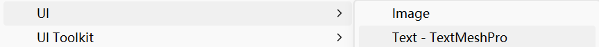

改变RenderMode为World Space

controller添加

```
[SerializeField] private GameObject keyPrefab;
[SerializeField] private List<KeyCode> KeyCodeList;

//OnTriggerEnter2D添加
//生成一个 keyPrefab（按键提示物体）实例，位置是在敌人头上偏移一点 + new Vector3(0, 2)。
GameObject newKey = Instantiate(keyPrefab, collision.transform.position + new Vector3(0, 2), Quaternion.identity);

//从 KeyCodeList 中随机选一个键位（比如 A、B、C、F...），赋值给 choosenKey。
KeyCode choosenKey = KeyCodeList[Random.Range(0, KeyCodeList.Count)];

//从列表中移除已选择的按键，防止重复选择。
KeyCodeList.Remove(choosenKey);

//获取新生成的 keyPrefab 上挂载的脚本，用来控制它的表现。
Blackhole_Key_Controller newKeyScript = newKey.GetComponent<Blackhole_Key_Controller>();

//调用该脚本中的 SetupKey() 方法，把刚才选择的按键传进去。
newKeyScript.SetupKey(choosenKey);
```

试验功能正常，对KeyController进行修改

```
private Transform enemy;
private Blackhole_Skill_Controller blackhole;
public void SetupKey(KeyCode _mNewKey,Transform _mEnemy,Blackhole_Skill_Controller _mBlackhole)
{
    mText = GetComponentInChildren<TextMeshProUGUI>();

    mKey = _mNewKey;
    mText.text = _mNewKey.ToString();

    enemy = _mEnemy;
    blackhole = _mBlackhole;
}
private void Update()
{
    if(Input.GetKeyDown(mKey))
    {
        blackhole.targets.Add(enemy);
        //重写函数后改为blackhole.AddEnemyToList(enemy);
        //重写public void AddEnemyToList(Transform _enemyTransform) => targets.Add(_enemyTransform);
    }

}
```

修改引用

```
newKeyScript.SetupKey(choosenKey, collision.transform, this);
//关键词是 this —— 它指的是当前类的实例，也就是 调用 CreateKey() 方法的脚本对象自身。
```

##### 渐变消失

KeyController加入

```
private SpriteRenderer sr;
sr=GetComponent<SpriteRenderer>();
//update
mText.color= Color.clear;
sr.color = Color.clear;
```

#### 瞬身斩

定义冷却

```
private bool canAttack;
public int amountOfAttacks = 2;
public float shadowAttackCD = .3f;
private float shadowAttackTimer;

private void Update()
{
    shadowAttackTimer -= Time.deltaTime;

    if(Input.GetKeyDown(KeyCode.R))
        canAttack = true;

    if(shadowAttackTimer < 0 && canAttack)
    {
        shadowAttackTimer = shadowAttackCD;

        int randomIndex =Random.Range(0,targets.Count);

        SkillManager.Instance.shadow.CreateShadow(targets[randomIndex]);
        amountOfAttacks--;

        if(amountOfAttacks <= 0)
        {
            canAttack = false;
        }
    }
```

##### 调整出现位置

在create方法加上offset

blackhole方法设具体值

```
float xOffset;
if (Random.Range(0, 100) > 50)
    xOffset = 2;
else
    xOffset = -2;
```

#### 销毁文字预制体

```
private List<GameObject> createdKey=new List<GameObject>();

//修改CreateKey内部
GameObject newKey = Instantiate(keyPrefab, collision.transform.position + new Vector3(0, 2), Quaternion.identity);
createdKey.Add(newKey);

private void DestroyKeys()
{
    if (createdKey.Count <= 0)
        return;
    for(int i = 0; i < createdKey.Count; i++)
    {
        Destroy(createdKey[i]);
    }
}

//并在每次按键前调用
if (Input.GetKeyDown(KeyCode.R))
{
    DestroyKeys();
    canAttack = true;
}
```

#### 销毁黑洞

```
if (canGrow && !canShrink)
{
    transform.localScale = Vector2.Lerp(transform.localScale, new Vector2(maxSize, maxSize), growSpeed * Time.deltaTime);
}

if (canShrink)
{
    transform.localScale = Vector2.Lerp(transform.localScale, new Vector2(-1, -1), growSpeed * Time.deltaTime);

    if (transform.localScale.x < 0)
        Destroy(gameObject);
}
```

#### 解冻

##### OnTriggerExit2D

`OnTriggerExit2D` 是 Unity 中的一个 **物理回调函数**，当某个物体（具有 2D Collider 且勾选了 `Is Trigger`）**离开** 另一个带有 Trigger 的 2D Collider 时会被调用。

```
//private void OnTriggerExit2D(Collider2D collision)
//{
//    if(collision.GetComponent<Enemy>()!=null)
//        collision.GetComponent<Enemy>().FreezeTime(false);
//}

private void OnTriggerExit2D(Collider2D collision) => collision.GetComponent<Enemy>()?.FreezeTime(false);
//?.	空值条件操作符（null-conditional operator），只有在不为 null 时才执行后面的调用。
```

#### 声明构造函数并实现Skill

```
using UnityEngine;

public class Blackhole_Skill : Skill
{
    [SerializeField] private GameObject blackholePrefab;
    [SerializeField] private float maxSize;
    [SerializeField] private float growSpeed;
    [SerializeField] private float shrinkSpeed;
    [Space]
    [SerializeField] private int amountOfAttacks;
    [SerializeField] private float shadowAttackCD;
    public override bool CanUseSkill()
    {
        return base.CanUseSkill();
    }

    public override void UseSkill()
    {
        base.UseSkill();

        GameObject newBlackhole =Instantiate(blackholePrefab);

        Blackhole_Skill_Controller newBlackholeScript =newBlackhole.GetComponent<Blackhole_Skill_Controller>();

        newBlackholeScript.SetupBlackhole(maxSize,growSpeed,shrinkSpeed,amountOfAttacks,shadowAttackCD);
    }

    protected override void Update()
    {
        base.Update();
    }
}
```

#### 黑洞状态(人物)

进入时移除重力

```
skillUsed = false;
stateTimer = flyTime;
player.rb.gravityScale = 0;
```

awake中，本质是跳跃

```
blackholeState = new PlayerBlackholeState(this, stateMachine, "Jump");
```

快速上浮

```
if (stateTimer > 0)//enter设置为小数
    player.rb.linearVelocity = new Vector2(0, 15);
```

#### 黑洞跟随

Blackhole_Skill中

```
GameObject newBlackhole =Instantiate(blackholePrefab,PlayerManager.instance.player.transform.position,Quaternion.identity);
```

#### 退出状态

player中

```
public void ExitBlackhole()
{
    stateMachine.ChangeState(airState);
}
```

在结束时调用

恢复重力：blackholestate设置默认重力，enter赋值，exit返回

### 龙王

核心技：初始段为调用子弹时间并进行一段长位移，对沿途进行打击，可增加多种派生。目标：随剧情发展，该技能逐渐觉醒，最终可化身为主角的另一形态：代号：龙王(Dragon)。

该部分为在加上RiderKick后派生补写的日志，一开始随便加的测试动作，在多种灵感的催生下产生化学反应，何等的斯巴拉西

依然是采用技能＋状态实现，整体类似dash

#### 调试过程

增加了kick到counter后加入派生

出现图像卡模，检测发现序列帧分割问题，进行手动分割，这也提示了精灵表的分割有时不能只是按原始图像等距，必须结合实际

增加滑行关键帧

为前两帧加上动画事件AttackTrigger

### 技能树UI建立

Hierarchy下新建Canvas，并更改缩放模式为根据屏幕大小，该步骤是为了使得其在不同分辨率下的大小不会发生变化

新建子对象UI_TreeNode，子对象新建两个UI Image，一个命名Background，另一个是图标本身

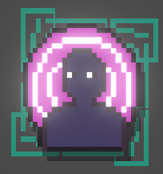

接下来使得该节点可交互，这就需要检测鼠标，显示信息和点击解锁

新建UI文件夹Script：UI_TreeNode，将脚本拖到对象上

头加入

```
using UnityEngine.EventSystems;

public class UI_TreeNode : MonoBehaviour, IPointerEnterHandler, IPointerExitHandler, IPointerDownHandler
```

alt+enter可快速添加

```
    public void OnPointerDown(PointerEventData eventData)
    {
        throw new System.NotImplementedException();
    }

    public void OnPointerEnter(PointerEventData eventData)
    {
        throw new System.NotImplementedException();
    }

    public void OnPointerExit(PointerEventData eventData)
    {
        throw new System.NotImplementedException();
    }
```

|          接口          |             核心作用             |           必须实现的方法           |                    触发场景                    |
| :--------------------: | :------------------------------: | :--------------------------------: | :--------------------------------------------: |
| `IPointerEnterHandler` |   监听「指针进入 UI 元素」事件   | `OnPointerEnter(PointerEventData)` |   鼠标光标 / 手指触摸进入该 UI 节点的范围时    |
| `IPointerExitHandler`  |   监听「指针离开 UI 元素」事件   | `OnPointerExit(PointerEventData)`  |   鼠标光标 / 手指触摸离开该 UI 节点的范围时    |
| `IPointerDownHandler`  | 监听「指针在 UI 元素上按下」事件 | `OnPointerDown(PointerEventData)`  | 鼠标左键 / 右键 / 中键（或触摸按下）在该节点上 |

这里测试交互，如果节点有两个对象会冲突，可以禁用Background的Raycast Target

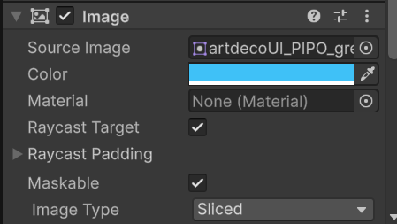

设置调试选项

```
    [SerializeField] private Image skillIcon;
    [SerializeField] private Color skillLockedColor;
    public bool isUnlocked;
    public bool isLocked;

    private void Awake()
    {
        UpdateIconColor(skillLockedColor);
    }

    private void Unlock()
    {
        isUnlocked = true;

        UpdateIconColor(Color.white);
    }

    private bool CanBeUnlocked()
    {
        if(isUnlocked||isLocked)
        {
            return false;
        }

        return true;
    }

    private void UpdateIconColor(Color color)
    {
        if (skillIcon == null)
            return;

        skillIcon.color = color;
    }

    public void OnPointerDown(PointerEventData eventData)
    {
        if (CanBeUnlocked())
        {
            Unlock();
        }
        else
            Debug.Log("解锁不能");
    }
```

记得设置节点透明度为255，不然会消失，点击后才出现

hover显示信息+悬浮

新建Assets/Scripts/Skills/SkillSystem/SkillDataSO.cs

ScriptableObject简介

感觉上类似prefab，可以创建一个模板

```
using UnityEngine;

[CreateAssetMenu(menuName = "RPG Setup/Skill Data", fileName = "Skill data - ")]
public class SkillDataSO : ScriptableObject
{
    public int cost;

    [Header("Skill description")]
    public string displayName;
    [TextArea]
    public string description;
    public Sprite icon;
}

```

完成后在树节点脚本加上

```
[SerializeField] private SkillDataSO skillData;
```

```
    private void OnValidate()
    {
        if (skillData == null)
            return;

        skillName = skillData.displayName;
        skillIcon.sprite = skillData.icon;
        gameObject.name = "UI_TreeNode - " + skillData.displayName;
    }
```

现在，只需要先在data里预制后再在树节点应用即可

Sprite处理，绿框代表拉伸范围，并将图片类型设为Sliced


shift+alt使得父子对象大小一致且同步改变，这使得改变父大小时可同时改变子大小


新建脚本UI_ToolTip

```
using UnityEngine;

public class UI_ToolTip : MonoBehaviour
{
    private RectTransform rect;

    private void Awake()
    {
        rect = GetComponent<RectTransform>();
    }

    public void ShowToolTip(bool show,RectTransform targetRect)
    {
        if(!show)
        {
            rect.position = new Vector2(9999, 9999);
            return;
        }

        UpdatePosition(targetRect);
    }
    public void UpdatePosition(RectTransform targetRect)
    {
        rect.position = targetRect.position;
    }
}

```

因为 SetActive 会导致 Unity 重新计算整个 Canvas 的网格（Canvas Rebuild），非常消耗性能。移出屏幕法既能“隐藏”UI，又能避免性能消耗。

为了使得子节点间互相访问，新建脚本UI，将其赋给Canvas节点(父)

```
using UnityEngine;

public class UI : MonoBehaviour
{
    public UI_ToolTip skillToolTip;

    private void Awake()
    {
        skillToolTip = GetComponentInChildren<UI_ToolTip>();
    }
}

```

之后在树节点声明并在awake()赋值

```
    private UI ui;
    private RectTransform rect;
```

赋予脚本后debug发现，移动鼠标会导致提示信息闪烁，这是因为在提示浮在节点上方时，会挡住鼠标检测使得其在当前位置和(9999，9999)处瞬移，移除ToolTip对象的Raycast Target后正常

#### 边界修复

防止ui溢出边界

**原理**：
根据目标在屏幕上的位置，动态修改 ToolTip 的 Pivot（轴心点）。

- 如果在屏幕左侧，Pivot 就靠左（0），ToolTip 向右延展。
- 如果在屏幕右侧，Pivot 就靠右（1），ToolTip 向左延展。
- 如果在屏幕顶部，Pivot 就靠上（1），ToolTip 向下延展。

debug发现高分辨不适用，采用数学动态放缩

```
using UnityEngine;

public class UI_ToolTip : MonoBehaviour
{
    private RectTransform rect;
    [SerializeField] private Vector2 baseOffset = new Vector2(300, 100);

    private void Awake()
    {
        rect = GetComponent<RectTransform>();
    }

    public void ShowToolTip(bool show, RectTransform targetRect)
    {
        if (!show)
            rect.position = new Vector2(9999, 9999);
        else
            UpdatePosition(targetRect);
    }

    public void UpdatePosition(RectTransform targetRect)
    {
        float screenCenterX = Screen.width / 2f;
        float screenCenterY = Screen.height / 2f;
        Vector2 targetPosition = targetRect.position;

        // 【核心代码】：根据屏幕宽高的比例动态放大偏移量
        // 假设在 4K 屏幕 (3840宽) 下：3840 / 1920 = 2。X偏移量自动 * 2
        float scaleX = Screen.width / 1920f;
        float scaleY = Screen.height / 1080f;

        Vector2 dynamicOffset = new Vector2(baseOffset.x * scaleX, baseOffset.y * scaleY);

        targetPosition.x = targetPosition.x > screenCenterX ? targetPosition.x - dynamicOffset.x : targetPosition.x + dynamicOffset.x;
        targetPosition.y = targetPosition.y > screenCenterY ? targetPosition.y - dynamicOffset.y : targetPosition.y + dynamicOffset.y;

        rect.position = targetPosition;
    }
}
```

#### 文字填充

使用 **TextMeshPro** 来显示文字

新建组件并采用字体，准备好字体后在上方Window-...导入

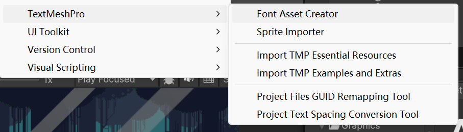

在GitHub上找了一个开源中文字符库，导入后结果

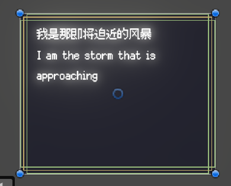

批量使用

新建脚本，继承自UI_ToolTip

这里用到了overload，和上面的方法同名，但多了一个参数 SkillDataSO skillData。这允许其他脚本（比如你的 UI_TreeNode）在调用时，顺便把技能数据塞进来。

```
using TMPro;
using UnityEngine;

public class UI_SkillToolTip : UI_ToolTip
{
    [SerializeField] private TextMeshProUGUI skillName;
    [SerializeField] private TextMeshProUGUI skillDescription;
    [SerializeField] private TextMeshProUGUI skillRequirements;

    public override void ShowToolTip(bool show, RectTransform targetRect)
    {
        base.ShowToolTip(show, targetRect);
    }

    public void ShowToolTip(bool show, RectTransform targetRect, SkillDataSO skillData)
    {
        base.ShowToolTip(show, targetRect);

        if (show == false)
            return;

        skillName.text = skillData.displayName;
        skillDescription.text = skillData.description;
        skillRequirements.text = "需求: \n" + "-" + skillData.cost + "专注";
    }
}

```

最后在树节点更新ShowToolTip函数，并修改挂在上面的脚本，则可以更新技能数据

```
    public void OnPointerEnter(PointerEventData eventData)
    {
        ui.skillToolTip.ShowToolTip(true, rect, skillData);

        UpdateIconColor(Color.white * .9f);

        // 变大+悬浮
        RectTransform rectTrans = skillIcon.GetComponent<RectTransform>();
        rectTrans.localScale = originalScale * hoverScale; // 放大
        rectTrans.anchoredPosition = originalPos + new Vector2(0, hoverYOffset); // 向上偏移
    }
```

小结

这五个脚本各司其职，构成了一个经典的 MVC（模型-视图-控制器）架构：

1. **SkillDataSO (数据层 / Model)****身份**：数据的载体（基于 ScriptableObject）。**职责**：纯粹用来存储单个技能的静态配置（如名字、描述、图标、消耗的专注点）。不需要挂载到场景中，方便策划在外部直接配置。
2. **UI (中枢管理层)****身份**：UI 系统的总管家。**职责**：挂载在最顶层的 Canvas 或 UI 根节点上。它负责去寻找并缓存 UI_SkillToolTip 的引用。这样下面的无数个技能节点就不需要各自去 Find 提示框了，直接找老总（UI）要就行。
3. **UI_TreeNode (交互与控制层 / Controller)****身份**：每一个具体的技能图标（节点）。**职责**：它拥有对应的 SkillDataSO 数据。负责监听玩家的鼠标操作（进入、移出、点击）。在玩家操作时，改变自身的颜色、大小，并通知提示框：“我被摸了，快把我的数据拿去显示！”
4. **UI_ToolTip (显示基类 / View Base)****身份**：所有提示框的“通用底层逻辑”。**职责**：只负责两件事：**怎么藏**（移到 9999 坐标外）和 **怎么防溢出**（根据屏幕 1080p/4K 分辨率动态计算偏移量，防止超框）。
5. **UI_SkillToolTip (具体显示层 / View Specific)****身份**：技能专用的提示框面板。**职责**：继承自基类。接收从节点传来的 SkillDataSO，把数据拆解开，一行一行地填入自己的 TextMeshPro 文本框里。


#### 自定义连接技能树

树节点新建image子对象为连接线，设置宽150高5，然后创建其父对象Connection

使其从边界增长而不是中间，这一步将枢轴改到左边即可

新建脚本UI_TreeConnectHandler

```
using System;
using System.Runtime.CompilerServices;
using UnityEngine;

[Serializable]

public class UI_TreeConnectionDetails
{
    public NodeDirectionType direction;
    [Range(100f,350f)] public float length;

}
public class UI_TreeConnectHandler : MonoBehaviour
{
    [SerializeField] private UI_TreeConnectionDetails[] details;
    [SerializeField] private UI_TreeConnection[] connections;
}

```

UI_TreeConnection

```
using UnityEngine;

public class UI_TreeConnection : MonoBehaviour
{

}

public enum NodeDirectionType
{
    None,
    UpLeft,
    Up,
    UpRight,
    Left,
    Right,
    DownLeft,
    Down,
    DownRight
}
```

实现方法函数

```
    public void DirectConnection(NodeDirectionType direction, float length)
    {
        bool shouldBeActive = direction != NodeDirectionType.None;
        float finalLength = shouldBeActive ? length : 0;
        float angle = GetDirectionAngle(direction);

        connectPoint.localRotation= Quaternion.Euler(0,0,angle);
        connectionLength.sizeDelta =new Vector2 (finalLength,connectionLength.sizeDelta.y);
    }
```

看起来很烧脑，但实际上就是将连接线可以在unity面板里进行8向调整并连接子技能

为了更好的连接子技能并变化连接线长度，需要在connection脚本加入

```
    [SerializeField] private RectTransform connectionPosition;
    public Vector2 GetConnectionPoint(RectTransform rect)
    {
        RectTransformUtility.ScreenPointToLocalPointInRectangle
        (
            rect.parent as RectTransform, // 参数 1：目标容器（把坐标转换到谁的底盘上？）
            connectionPosition.position,  // 参数 2：绝对真理（插座在屏幕/世界上的绝对坐标）
            null,                         // 参数 3：摄像机（Canvas是Overlay模式填null即可）
            out var localPosition         // 参数 4：输出结果（算出来的本地坐标存到这里）
        );
        return localPosition;
    }
```


这段代码是 Unity UI 开发中**含金量极高**的一段代码。它解决了一个所有做连线、拖拽、UI跟随系统都会遇到的世纪难题：**UI 坐标系转换（Coordinate Hell）**。

简单来说，它的作用是：**精准计算出“连线”应该连接到当前技能节点的哪个具体位置。**

现在已经可以自由加入节点技能

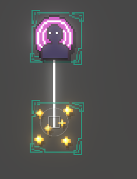

#### 技能解锁顺序系统


## 属性系统

新建

### CharacterStats.cs

```
//Entity中声明
public CharacterStats stats { get; private set; }
//Start()
stats = GetComponent<CharacterStats>();
```

```
//基本HP构建
public int damage;
public int maxHP;

private int currentHP;
void Start()
{
    currentHP = maxHP;
}

public void TakeDamage(int _damage)
{
    currentHP -= _damage;
    
    if (currentHP < 0)
    Die();
}
```

```
//在AnimationTriggers调用
hit.GetComponent<CharacterStats>().TakeDamage(player.stats.damage);
```

新建

### Stat.cs

清除继承和所有默认信息

```
//[System.Serializable] 是 Unity 和 C# 中用于 让一个类或结构体能在 Unity Inspector 中显示并保存数据 的标记（Attribute）。
using UnityEngine;

[System.Serializable]
public class Stat
{
    private int baseValue;
    
    public List<int> modifiers;

    public int GetValue()
    {
        return baseValue;
    }
    
    public void AddModifier(int _modifier)
{
    modifiers.Add(_modifier);
}

public void RemoveModifier(int _modifier)
{
    modifiers.Remove(_modifier);
}
}
```

这样操作可以在Unity如下显示，便于编辑封装

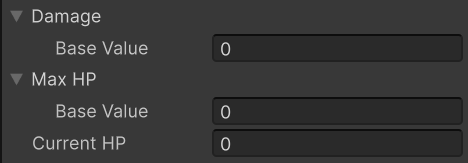

| 用法          | 删除目标   | 安全性           | 适用情况             |
| ------------- | ---------- | ---------------- | -------------------- |
| `Remove(val)` | 按值删除   | 安全，不会抛异常 | 你知道你想删哪个对象 |
| `RemoveAt(i)` | 按索引删除 | 小心越界         | 已知元素索引         |

由于此时还未加上修正，对GetValue进行修改

```
public int GetValue()
{
    int finalValue = baseValue;

    foreach (int modifier in modifiers)
    {
        finalValue += modifier;
    }

    return finalValue;
}
```

### 重写玩家状态和敌人状态

将Start，TakeDamage和Die改为virtual

新建PlayerStats和EnemyStats,继承CharacterStats,在Unity中拖入

```
//CharacterStats
public Stat strength;
public virtual void DoDamage(CharacterStats _targetStats)
{
    int totalDamage=damage.GetValue()+strength.GetValue();
    _targetStats.TakeDamage(totalDamage);
}
```

```
//改动AnimationTrigger的受击检测部分
if (hit.GetComponent<Enemy>() != null)
{
    EnemyStats _target=hit.GetComponent<EnemyStats>();

    player.stats.DoDamage(_target);

    hit.GetComponent<Enemy>().Damage();
}
//之后对敌人的AnimationTrigger同样改动
```

### 死亡状态

动画状态设置完毕后

```
//PlayerStat重写
```

Enemy新增

```
public string lastAnimBoolName {  get; private set; }
public virtual void AssignLastAnimBoolName(string _animBoolName)
{
    lastAnimBoolName = _animBoolName;
}
```

Entity新增

```
public CapsuleCollider2D capsuleCollider { get; private set; }
//start
capsuleCollider = GetComponent<CapsuleCollider2D>();
```

enemy死亡状态

```
//deadstate enter
enemy.anim.SetBool(enemy.lastAnimBoolName, true);
//enemystate exit
enemyBase.AssignLastAnimBoolName(animBoolName);
//deadstate enter
enemy.anim.speed = 0;
enemy.capsuleCollider.enabled = false;

stateTimer = .1f;
//update
if (stateTimer > 0)
{
    enemy.rb.linearVelocity = new Vector2(0, 10);
}
//这种死亡方式可以像Mario一样掉出屏幕，适用于没有死亡动画的敌人
//对Skeleton来说太low了，换回正常方式
```

### 元素系统

```
//完善CharacterStats
[Header("Major Stats")]
public Stat strength;
public Stat intelligence;

public Stat damage;

[Header("Defensive Stats")]
public Stat maxHP;
public Stat ElementResistance;

[Header("Element Stats")]
public Stat fireDamage;
public Stat iceDamage;
public Stat thunderDamage;

public bool isIgnited;
public bool isChilled;
public bool isShocked;
```

```
public virtual void DoMagicalDamage(CharacterStats _targetStats)
{
    int _fireDamage = fireDamage.GetValue();
    int _iceDamage = iceDamage.GetValue();
    int _thunderDamage = thunderDamage.GetValue();

    int totalMagicalDamage = _fireDamage + _iceDamage + _thunderDamage + intelligence.GetValue();
    totalMagicalDamage = CheckTargetResistance(_targetStats, totalMagicalDamage);

    _targetStats.TakeDamage(totalMagicalDamage);
}

private static int CheckTargetResistance(CharacterStats _targetStats, int totalMagicalDamage)
{
    totalMagicalDamage -= _targetStats.ElementResistance.GetValue();
    totalMagicalDamage = Mathf.Clamp(totalMagicalDamage, 0, int.MaxValue);
    return totalMagicalDamage;
}

public void ApplyAilments(bool _ignite, bool _chill, bool _shock)
{
    if (isIgnited || isChilled || isShocked)
        return;

    isIgnited = _ignite;
    isChilled = _chill;
    isShocked = _shock;
}
```

### 实现异常状态

参考塞尔达

```
//完善public virtual void DoMagicalDamage(CharacterStats _targetStats)
...
if (Mathf.Max(_fireDamage, _iceDamage, _thunderDamage) <= 0)
    return;
bool canApplyIgnite = _fireDamage > _iceDamage && _fireDamage > _thunderDamage;
bool canApplyChill = _iceDamage > _fireDamage && _iceDamage > _thunderDamage;
bool canApplyShock = _thunderDamage > _fireDamage && _thunderDamage > _iceDamage;

_targetStats.ApplyAilments(canApplyIgnite, canApplyChill, canApplyShock);

//最后记得在AnimationTrigger应用
player.stats.DoMagicalDamage(_target);
```

#### 火异常

```
private float igniteTimer;
private float igniteDamageCD;
private float igniteDamageTimer;

//update
igniteTimer -= Time.deltaTime;
igniteDamageTimer -= Time.deltaTime;

if(igniteTimer < 0)
    isIgnited = false;

if(igniteDamageTimer < 0 && isIgnited)
{
    Debug.Log("烧起来了");
    igniteDamageTimer = igniteDamageCD;
    TakeDamage(1);
}
```

#### 冰异常

#### 雷异常

### 异常视觉特效

实现该部分需要运用一个十分重要的部分：Shader

用闪烁简易实现

### 血条UI

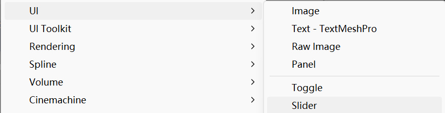

UI->Slider,删除，改变background图片，进入Canavas，渲染模式改为WorldSpace，改变Layer和大小，position全0.选中子对象，按住alt+shift点击右下角随父对象大小填充。交换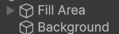位置以显示边框。红色区域由Slider->Value控制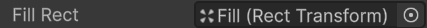确保被分配

#### 解决血条随实体翻转(Event)

进入Entity

```
public System.Action onFlipped;

//Flip引用
onFlipped();
```

新建HealthBarUI并拖入

```
private Entity entity;
private RectTransform rt;

private void Start()
{
    rt = GetComponent<RectTransform>();
    entity=GetComponentInParent<Entity>();

    entity.onFlipped += FlipUI;
}

private void FlipUI()
{
    rt.Rotate(0, 180, 0);
}
```

无血条报错解决

```
if (onFlipped != null)
    onFlipped();
//也可以
onFlipped?.Invoke();
```

#### 随血量应用

```
//HealthBarUI中
private Slider slider;
private CharacterStats cs;
//start
slider=GetComponentInChildren<Slider>();
cs=GetComponentInParent<CharacterStats>();

private void Update()
{
    UpdateHealthUI();
}
private void UpdateHealthUI()
{
    slider.maxValue = cs.maxHP.GetValue();
    slider.value = cs.currentHP;
}
```


## 碰撞检测

```
[Header("Collision info")]
[SerializeField] private Transform groundCheck;
[SerializeField] private float groundCheckDistance;
[SerializeField] private Transform wallCheck;
[SerializeField] private float wallCheckDistance;
[SerializeField] LayerMask whatIsGround;
[SerializeField] LayerMask whatIsWall;
```

设置Layer后别忘了在Unity中添加并修改Platform等类型，whatIsGround改为Ground

OnDrawGizmoz()

```
private void OnDrawGizmos()
{
    Gizmos.DrawLine(groundCheck.position, new Vector3(groundCheck.position.x, groundCheck.position.y - groundCheckDistance));
    Gizmos.DrawLine(wallCheck.position, new Vector3(wallCheck.position.x + wallCheckDistance, wallCheck.position.y));
}
```

Raycast射线检测

```
public bool IsGroundDetected() => Physics2D.Raycast(groundCheck.position, Vector2.down, groundCheckDistance, whatIsGround);
public bool IsWallDetetected() => Physics2D.Raycast(wallCheck.position, Vector2.right, wallCheckDistance, whatIsWall);
```

跳跃条件加上且AirState落地条件修改为

```
player.IsGroundDetected()
```

#### 移除Player Enemy之间的碰撞

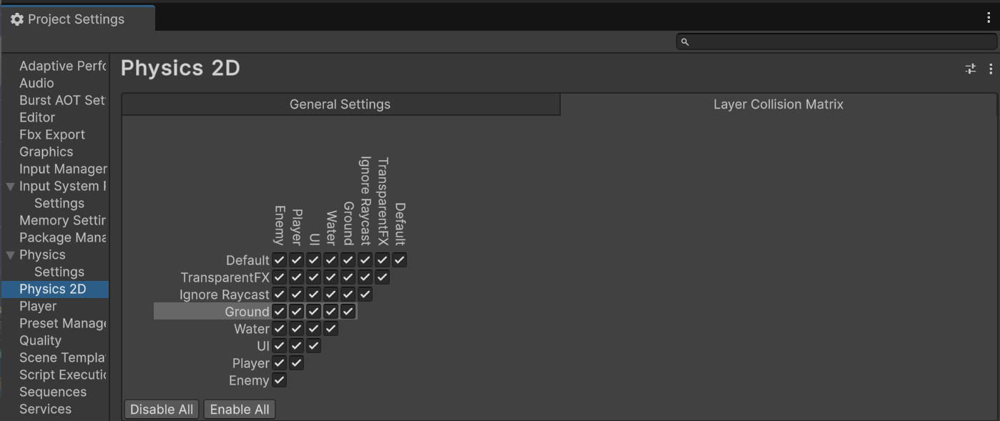

## Tile Palette

铁出生环节

选择菜单栏中的 `Window > 2D > Tile Palette`

在 Unity 中，**Tile Palette** 是一个用于在 2D 游戏中创建和编辑 **Tilemap** 的工具。Tilemap 是 Unity 中用于制作 2D 网格世界的系统，它允许你轻松地布置 2D 游戏世界的瓦片（Tiles），并通过可视化编辑快速构建复杂的地图。

**Tile Palette** 作为一个编辑器窗口，允许你将预设的瓦片拖拽到场景中的 Tilemap 上，从而生成游戏场景。它在2D游戏制作中尤其重要，尤其是对于类似平台游戏、策略游戏和 RPG 游戏等需要网格布局的游戏。

**创建 Tilemap**：

- 在 Unity 中，右键点击层级视图 (`Hierarchy`) 中的空白区域，选择 `2D Object > Tilemap > Rectangular`（或者其他类型，如 Isometric）。

- 这将创建一个 Tilemap 对象，并且 Unity 会自动为你创建一个 Grid 作为父对象。

  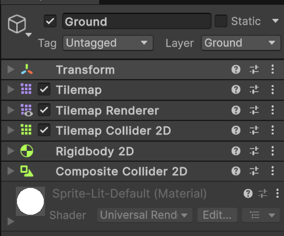

改变Layer并添加两个Collider 2D 改变相关参数

对于地面

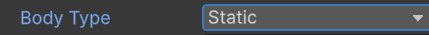

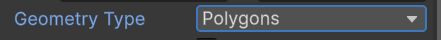

对于背景

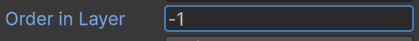

## Camera

菜单栏选择 `Window > Package Manager`安装Cinematic Studio和Cinemachine

## Background

add sorting layers并分配给各对象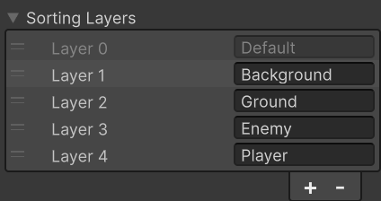

新建

### ParallaxBackground.cs

```
using UnityEngine;

public class ParallaxBackground : MonoBehaviour
{
    private GameObject cam;

    [SerializeField] private float parallaxEffect;

    private float xPosition;
    void Start()
    {
        cam = GameObject.Find("Main Camera");

        xPosition = transform.position.x;
    }

    void Update()
    {
        float distanceToMove = cam.transform.position.x * parallaxEffect;
        //相机越往右移动，背景图移动得越慢，制造出“景深感”

        transform.position = new Vector3(xPosition + distanceToMove, transform.position.y);
        //这里将背景 重新设置在一个偏移的位置，保持它随着相机动而“滑动”，但不是直接跟随相机。
    }
}

```

### 水面效果

安装Universal RP,unity6好像自带？在Graphics和Quality分别设置，然后Create Render Texture

新建一个Camera 设置output texture，projection设置为Orthographic记得默认Z为-10，不然看不到，并且在添加之前的平行移动脚本时，因未设置z变化而运行时不显示，要单独把z赋值为物体自身z


## Enemy状态机

新建Entity类，重新将Player和Enemy继承，并复写相关函数

Enemy创建流程:拖入第一帧贴图，重命名Animator，创建父对象命名，添加成员Animator，后单独写脚本，继承Enemy

Animator贴图不要改变位置，会导致Flip出错

### 嘟嘟哒嘟嘟哒

Enemy_Skeleton.cs

这里在具体状态里，需要改变构造函数写法

#### ✅ 情况 ① —— 只传 `Enemy` 类型

```
public SkeletonMoveState(Enemy _enemy, EnemyStateMachine _stateMachine, string _animBoolName) 
    : base(_enemy, _stateMachine, _animBoolName)
{
    // 什么也不做
}
```

#### ✅ 情况 ② —— 额外传入 `Enemy_Skeleton`，并保留引用

```
Enemy_Skeleton enemy;

public SkeletonIdleState(Enemy _enemyBase, EnemyStateMachine _stateMachine, string _animBoolName, Enemy_Skeleton _enemy) 
    : base(_enemy, _stateMachine, _animBoolName)
{
    enemy = _enemy;
}
```

------

🧠 核心区别在于：

| 点                                                 | 情况①                         | 情况②                                |
| -------------------------------------------------- | ----------------------------- | ------------------------------------ |
| 构造函数参数                                       | 只传 `Enemy`                  | 同时传 `Enemy_Skeleton`（更具体）    |
| 状态类中保存的对象类型                             | 只能访问 `Enemy` 的属性和方法 | 可以访问 `Enemy_Skeleton` 的特有功能 |
| 用于简单共通逻辑                                   | ✅ 适用                        | ✅ 适用                               |
| 用于需要具体敌人的状态（比如 Skeleton 的独特攻击） | ❌ 不够                        | ✅ 推荐                               |

------

✅ 举个具体例子：

如果你有一个状态中需要使用 `Enemy_Skeleton` 的专属方法，比如：

```
enemy.SummonBones();
enemy.playerDetected;
enemy.animator.Play("SkeletonJumpAttack");
```

那你 **必须使用** 第二种写法，并在构造时保留 `Enemy_Skeleton enemy` 的引用。

否则，第一种写法中你拿到的是基类 `Enemy` 类型，只能用一些通用方法（如 `TakeDamage()`、`Move()` 等），无法访问 `Enemy_Skeleton` 特有的东西。

------

✨ 总结

| 使用场景                     | 推荐写法                              |
| ---------------------------- | ------------------------------------- |
| 通用状态，多个敌人通用       | `Enemy _enemy`（第一种写法）          |
| 特定敌人状态，只给某个敌人用 | `Enemy_Skeleton _enemy`（第二种写法） |

所以你会发现很多状态机结构都采用 **“父类接收 + 子类转换”** 的方式，让状态逻辑既复用，又灵活。

#### EnemyBattleState.cs

在Enemy增加新的LayerMask

```
public LayerMask whatisPlayer;
public virtual RaycastHit2D IsPlayerDetected() => Physics2D.Raycast(wallCheck.position, Vector2.right * facingDir, 50, whatisPlayer);
```

当你在 2D 场景中使用 `Physics2D.Raycast(...)` 发出一条射线时，如果它击中了某个物体，Unity 会返回一个 `RaycastHit2D` 类型的数据，里面包含：

| 字段/属性   | 作用                                           |
| ----------- | ---------------------------------------------- |
| `collider`  | 被击中的 Collider2D                            |
| `point`     | 击中的世界坐标位置                             |
| `normal`    | 撞击点表面的法线方向                           |
| `distance`  | 从起点到撞击点的距离                           |
| `fraction`  | 相对于最大距离的比例（distance / maxDistance） |
| `rigidbody` | 命中的刚体（Rigidbody2D）                      |
| `transform` | 命中的物体的 Transform                         |
| `centroid`  | 击中的形心点（用于碰撞体形状分析）             |

Enemy新建Attack info

```
[Header("Attack info")]
public float attackDistance;
public float attackCooldown;
[HideInInspector] public float lastTimeAttacked;
```

#### SkeletonAttackState.cs

继承EnemyState，最好不要继承GroundState,update()冲突

攻击过程设置update速度为0,并且检测triggerCalled退回BattleState

Enemy攻击CD

Exit()设置

```
enemy.lastTimeAttacked=Time.time;
```

battlestate

```
private bool CanAttack()
{
    if (Time.time > enemy.lastTimeAttacked + enemy.attackCooldown)
        return true;
    return false;
}
```

#### 脱战机制

每当检测到player

```
stateTimer = enemy.battleTime;
```

小于0则回到idleState


！isGroundDetected()

## Shader

Shader 是用来控制物体表面如何被渲染（即如何表现光照、颜色、纹理等视觉效果）的程序。Shader 是图形渲染的核心，它告诉 GPU 如何处理每个像素或顶点。Unity 提供了多种 Shader 类型和写法，适用于不同的渲染需求

### **Bloom（泛光）** 

**Bloom** 是一种后处理（Post-Processing）效果，用于模拟非常明亮的区域“溢出”到周围的光晕效果。

### 刀光

实现刀光的基本思路

- 让贴图中目的部分发出更明亮的颜色
- 用bloom进行处理

要将发光部分提取出来，处理完后再覆盖回原来的图片：制作一张黑白的次级图片，白色部分对应图中需要发光的部分

使用ps制作：

- PS中打开精灵图
- 选择魔棒工具，容差为0，勾选添加到选区
- 选取完毕后新建图层，隐藏原图层
- 编辑->填充 白色
- 之后取消魔棒选取，油漆桶容差改为0后填充黑色
- 制作完毕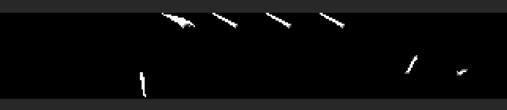

使用黑白图片原因，黑色RGB为0，便于图片运算

该方法是简单方法，实际结果受底色影响

### 次级纹理

将上一步的黑白图片制作成主图片的次级纹理

将图片加入项目，:warning: 注意图片的type要改为Default


注意确认Sprite的材质，需要是可受光源影响的


### 添加bloom进行后处理

重要！main camera里勾选支持后处理

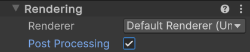

添加Global Volume，点击new

添加override-bloom


| 参数          | 作用                               |
| ------------- | ---------------------------------- |
| **Threshold** | 最低亮度阈值（越低越容易产生光晕） |
| **Intensity** | 发光强度（值越高越亮）             |

### 添加全局光源


强度调到0.8左右

### ShaderGraph

新建文件夹用于存放ShaderGraph

创建


双击打开可视化编辑界面

右键刚创建的SG Create-Material，将材料挂到Player上，此时由于还没有开始编写ShaderGraph，所以显示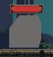是正常的

进入ShaderGraph，新建Texture2D，它接受一个Texture2D类型的输入，输出一个Texture2D类型的RGBA

创建一个Sample T2D

这时可以看到人物已经出现了

重点次级纹理名称要对应之后的shader

之后添加次级纹理，这里有个命名技巧，将次级纹理名前加下划线，在ShaderGraph添加名为无下划线的版本，引擎会自动搜索该纹理并添加

是主纹理的RGBA和次级纹理的R相加是为了防止主纹理透明度被覆盖


新建Color变量，使其与次级纹理相乘后加主纹理，此时出现问题：人物其它状态会一直全身发光，只有Oath正常，这是因为次级纹理默认模式是White，将其调为Black后问题解决

大冰刀这一块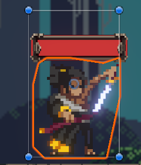

颜色的模式改为HDR且亮度调高

多个纹理相加

extra：防止底色影响过大，首先将3个黑白纹理使用one minus反向，得到背景白色，关键部位黑色的纹理。然后和主纹理相乘，白色背景对主纹理不会有任何改变，黑色部位会把主纹理对应部位清0。再将修改完颜色的原黑白次级纹理，和经过加工的主纹理相加，就不会受到主纹理的底色影响了


## 动画更新

promt合集

- Nano Banana 加入Smear Frame（拖影帧 / 涂抹帧）效果就是夸张扭曲效果来体现速度感
- 为我将要使用的生图AI生成Prompt，我想为我的暗黑像素风游戏生成关卡背景图，要求包含几种富有特色的场景，可以体现游戏设计水平同时具有美观个性的画风
- 无论使用哪个场景，请在你的Prompt末尾加上以下核心格式控制词，这能保证生成出符合你代码的图像：

  > **英文后缀:** 2D game background, side-scrolling platformer, horizontal layout, distinct depth layers (foreground, midground, background), parallax ready, flat layers, dark pixel art, 16-bit style, Castlevania style, high quality, masterpiece --ar 16:9 --stylize 150 --v 6.0
  > **中文解释:** 2D游戏背景，横版跳跃游戏，水平布局，明显的深度层级（前景、中景、远景），视差准备，扁平图层，暗黑像素风，16位机风格，恶魔城风格，高质量，杰作（比例建议16:9或更长的21:9）。

  


